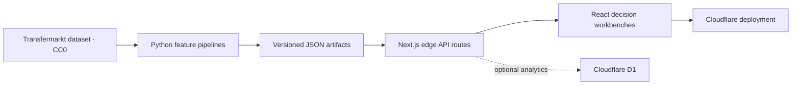

# Touchline Intelligence

An end-to-end Premier League analytics platform that turns historical football data into three recruiter-facing products: player valuation, similarity scouting, and calibrated match forecasting.

**[Live demo](https://touchlineintelligence.com/)** · [API reference](docs/API.md) · [Architecture](docs/ARCHITECTURE.md) · [Portfolio notes](docs/PORTFOLIO.md)


## Why this project exists

Most portfolio ML projects stop at a notebook. Touchline carries the work through the full product lifecycle: reproducible Python training pipelines, versioned model artifacts, typed edge APIs, an interactive React interface, automated verification, and a live deployment.

### Product surfaces

- **Valuation workbench** estimates a player's market value and uncertainty range from 12 football and profile features.
- **Scouting lab** retrieves same-position alternatives using standardized Euclidean nearest neighbours and explains the strongest shared signals.
- **Match lab** returns calibrated home/draw/away probabilities from sequential Elo and rolling five-match form.

## Architecture



The deployed app performs inference from compact, immutable JSON artifacts. It does not scrape websites or retrain models at request time. See [docs/ARCHITECTURE.md](docs/ARCHITECTURE.md) for the data flow and design trade-offs.

## Model results

| Capability | Method | Evaluation | Result |
| --- | --- | --- | --- |
| Player valuation | Ridge regression on log market value | Seeded 80/20 holdout, 414 players | R² **0.6135**, MAE **€9.9m** |
| Match forecasting | Regularized multinomial logistic regression + temperature scaling | Chronological season split, 380-match test set | Accuracy **48.16%** |
| Similarity scouting | Same-position standardized nearest neighbours | 414-player index | Explainable top-5 retrieval |

These are transparent baselines, not claims of production-grade sporting certainty. Market values are noisy estimates, and match accuracy should be interpreted alongside calibration metrics in the artifact.

## Stack

- TypeScript, React 19, Next.js 16, Tailwind CSS
- Python, NumPy, reproducible feature-engineering pipelines
- Cloudflare Workers and optional D1 persistence
- Node test runner and GitHub Actions CI

## Run locally

Requirements: Node.js 22.13+, pnpm 11, and Python 3.11+ only if retraining.

```bash
pnpm install
pnpm dev
```

Open `http://localhost:3000`. The committed model artifacts make local inference work without Python or source data.

### Verify the project

```bash
pnpm check
```

This validates the model artifact contracts, creates a production build, and runs the rendered-HTML test suite.

### Retrain the models

Place the upstream compressed CSVs in `work/source-data/`, then run:

```bash
python -m venv .venv
source .venv/bin/activate
pip install -r pipeline/requirements.txt
python pipeline/train_model.py
python pipeline/train_match_model.py
```

The pipelines use the CC0-licensed [dcaribou/transfermarkt-datasets](https://github.com/dcaribou/transfermarkt-datasets). Exact methodology and artifact metadata are documented in [data/README.md](data/README.md).

## API

| Endpoint | Purpose |
| --- | --- |
| `GET /api/predict` | Valuation model metadata and metrics |
| `POST /api/predict` | Estimate value from a player profile |
| `GET /api/scouting` | Search players or retrieve comparable profiles |
| `GET /api/matches` | List teams or forecast a fixture |

See [docs/API.md](docs/API.md) for parameters, examples, and response shapes.

## Repository map

```text
app/        product UI and edge API routes
data/       versioned inference artifacts
pipeline/   reproducible Python training jobs
scripts/    repository and artifact verification
tests/      rendered-output checks
docs/       architecture, API, and portfolio material
```

## Roadmap

- Backtest against bookmaker and simple-frequency baselines
- Add prediction monitoring and model-drift reporting
- Introduce team-strength uncertainty and player-position-specific valuation models
- Expand browser-level tests for all three workflows

## License and attribution

Code is available under the [MIT License](LICENSE). The upstream football dataset is separately released under CC0 1.0 by its maintainers. Touchline is an educational portfolio project and not financial, betting, or recruitment advice.
