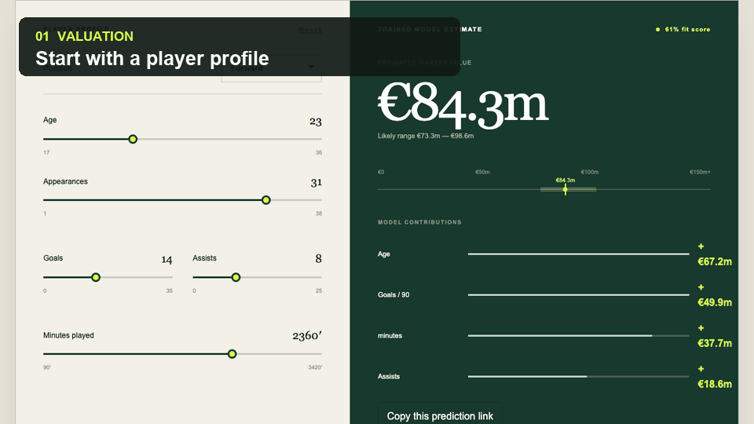
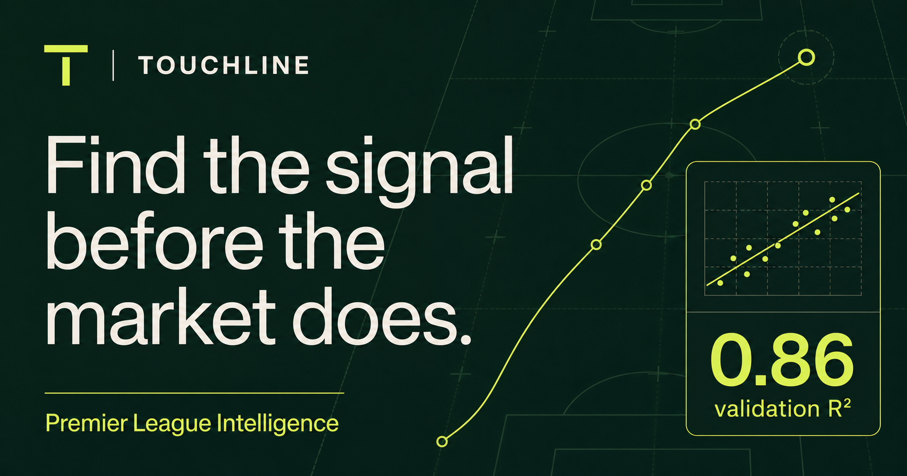
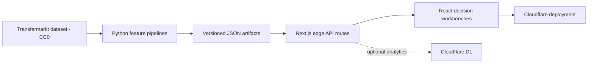

# Touchline Intelligence

[](https://github.com/pharzy1/touchline-intelligence/actions/workflows/ci.yml)


An end-to-end Premier League analytics platform that turns historical football data into an integrated suite for squad planning, player valuation, similarity scouting, transfer analysis, and calibrated match forecasting.

**[Live demo](https://touchlineintelligence.com/)** · [API reference](docs/API.md) · [Architecture](docs/ARCHITECTURE.md) · [Portfolio notes](docs/PORTFOLIO.md)





## Why this project exists

Most portfolio ML projects stop at a notebook. Touchline carries the work through the full product lifecycle: reproducible Python training pipelines, versioned model artifacts, typed edge APIs, an interactive React interface, automated verification, and a live deployment.

### Product surfaces

- **Valuation workbench** estimates a player's market value and uncertainty range from 12 football and profile features.
- **Scouting lab** retrieves same-position alternatives using standardized Euclidean nearest neighbours and explains the strongest shared signals.
- **Transfer builder** composes scouting and valuation into shareable replacement-cost scenarios with multi-player radar comparisons.
- **Squad planner** builds 23-player club or custom squads across three formations, diagnoses coverage and roster risk, finds affordable model-backed replacements, compares the squad before and after a window, and reopens named plans saved on-device.
- **Licensed media pipeline** caches vetted Commons thumbnails, stores author/licence/source metadata, and falls back safely when identity is uncertain.
- **Match lab** returns calibrated home/draw/away probabilities from sequential Elo and rolling five-match form.
- **Live record** snapshots upcoming predictions before kickoff, grades them after full time, and publishes accuracy and Brier score over time.
- **Player intelligence pages** apply the deployed model to four seasons of performance, benchmark estimates against position peers, and keep the latest recorded value explicitly separate from inferred history.
- **Model registry** publishes challenger metrics, promotion gates, feature and prediction drift, evaluation history, and the rollback contract behind every artifact change.
- **Live player-data lifecycle** fetches the upstream CC0 tables weekly, fingerprints every input, detects transfers and value/performance changes, blocks malformed snapshots, and proposes reviewed artifact updates through GitHub.
- **Collaborative scouting rooms** authenticate users with ChatGPT, synchronize squad and transfer plans to D1, enforce owner/editor/viewer permissions, retain immutable versions and activity, support comments and optimistic recovery, and issue revocable access and read-only links.
- **Private operations console** reports traffic, latency, errors, security denials, provider health, durable rate limits, automatic alerts, and privacy-bounded retention from production D1 telemetry.
- **Durable notification system** delivers collaboration events and weekly briefings to an account inbox through an idempotent queue with leases, exponential-backoff retries, dead-letter capture, and user-controlled preferences.

## Architecture



The deployed app performs inference from compact, immutable JSON artifacts. It does not scrape websites or retrain models at request time. See [docs/ARCHITECTURE.md](docs/ARCHITECTURE.md) for the data flow and design trade-offs.

## Engineering decisions

Training, calibration, and test data are split **chronologically** for match forecasting so future results cannot leak into earlier predictions. Training emits versioned JSON artifacts with explicit schemas, keeping model training separate from low-latency serving; `pnpm verify:artifacts` rejects malformed or incompatible artifacts before deployment. A weekly lifecycle job fetches and fingerprints the upstream CC0 tables, detects player additions/removals, club transfers, market-value changes, and new performance totals, then retrains ridge and gradient-boosted candidates. Source contracts, identity/domain checks, season monotonicity, history coverage, change-rate limits, holdout/CV quality, artifact compatibility, feature drift, and prediction drift must all pass before a reviewable pull request opens. Edge routes on Cloudflare Workers were chosen over a permanently running server because inference is small, deterministic, and globally cache-adjacent. Every public route uses Zod validation and typed errors, emits structured latency logs, persists anonymous request telemetry to D1, and applies a durable per-user/IP rate limit using rotating one-way identifiers. Scheduled fixture syncs persist success/failure telemetry, enforce 30-day retention, raise operational alerts, power a public `/status` dashboard, and retain detailed errors only in the private operations console. A redundant GitHub Actions scheduler authenticates with a short-lived, claim-verified OIDC token instead of a duplicated production secret. Workspace authorization is evaluated server-side for every read and mutation, collaborator invitations bind by normalized email and stable user ID, role boundaries protect owner-only operations, stale writes return `409`, and immutable activity records preserve accountability. Notification delivery uses idempotency keys, expiring job leases, bounded exponential-backoff retries, dead-letter capture, and explicit per-user preferences. `pnpm check` validates artifacts, creates a production build, and runs the twenty integration tests before CI can deploy.

## Model results

| Capability | Method | Evaluation | Result |
| --- | --- | --- | --- |
| Player valuation | Ridge regression on log market value | Seeded 80/20 holdout, 414 players | R² **0.6135**, MAE **€9.9m** |
| Match forecasting | Regularized multinomial logistic regression + temperature scaling | Chronological season split, 380-match test set | Accuracy **48.16%** |
| Similarity scouting | Same-position standardized nearest neighbours | 414-player index | Explainable top-5 retrieval |

These are transparent baselines, not claims of production-grade sporting certainty. Market values are noisy estimates, and match accuracy should be interpreted alongside calibration metrics in the artifact.

### Numbers versus baselines

| Evaluation | Touchline | Baseline / alternative | Outcome |
| --- | ---: | ---: | --- |
| Valuation holdout R² | **0.6135** | Gradient-boosted trees 0.5500 | Ridge retained for accuracy and explainability |
| Valuation holdout MAE | **€9.91m** | Gradient-boosted trees €10.54m | €0.63m lower error |
| Valuation 5-fold CV | R² **0.400 ± 0.286** | — | Variance reported, not hidden behind one split |
| Match test accuracy | **48.16%** | Always-home 42.63% | +5.53 percentage points |
| Match test accuracy | 48.16% | Elo favourite **49.47%** | Honest result: Elo remains stronger on this test set |

## Stack

- TypeScript, React 19, Next.js 16, Tailwind CSS
- Python, NumPy, scikit-learn, reproducible feature-engineering pipelines
- Cloudflare Workers and optional D1 persistence
- Node test runner and GitHub Actions CI

## Run locally

Requirements: Node.js 22.13+, pnpm 11, and Python 3.11+ only if retraining.

```bash
pnpm install
pnpm dev
```

Open `http://localhost:3000`. The committed model artifacts make local inference work without Python or source data.

### Verify the project

```bash
pnpm check
```

This validates model artifact contracts, creates a production build, and runs the rendered-HTML integration suite. `pnpm test:e2e` adds Playwright coverage for valuation, scouting, squad planning and saved-plan recovery, transfers, player histories, matches, live performance, production status, and the model registry. GitHub Actions runs both suites on every push and pull request and retains Playwright reports and traces for diagnosis.

### Retrain the models

Place the upstream compressed CSVs in `work/source-data/`, then run:

```bash
python -m venv .venv
source .venv/bin/activate
pip install -r pipeline/requirements.txt
python pipeline/train_model.py
python pipeline/train_match_model.py
```

The pipelines use the CC0-licensed [dcaribou/transfermarkt-datasets](https://github.com/dcaribou/transfermarkt-datasets). Exact methodology and artifact metadata are documented in [data/README.md](data/README.md).

## API

| Endpoint | Purpose |
| --- | --- |
| `GET /api/predict` | Valuation model metadata and metrics |
| `POST /api/predict` | Estimate value from a player profile |
| `GET /api/scouting` | Search players or retrieve comparable profiles |
| `GET /api/matches` | List teams or forecast a fixture |
| `GET /api/stats` | Anonymous API volume and latency aggregates |
| `GET /api/performance` | Immutable pre-match prediction ledger and live grading metrics |

See [docs/API.md](docs/API.md) for parameters, examples, and response shapes.

## Repository map

```text
app/        product UI and edge API routes
data/       versioned inference artifacts
pipeline/   reproducible Python training jobs
scripts/    repository and artifact verification
tests/      rendered-output checks
docs/       architecture, API, and portfolio material
```

## Shipped engineering depth

- Bootstrap uncertainty intervals and per-prediction ridge coefficient contributions
- Ridge versus gradient-boosted tree comparison plus 5-fold cross-validation
- Shareable valuation URLs, explicit match baselines, and D1 request instrumentation
- Six-hour fixture sync, immutable pre-kickoff predictions, post-match grading, and a public accountability curve
- Pipeline-time Wikimedia Commons enrichment with local caching, artifact validation, attribution UI, and position-based fallback avatars
- Zod validation, typed API errors, structured logs, rate limiting, error recovery, and thirteen Playwright E2E flows
- Interactive 23-player squad planning across three formations with depth/risk diagnostics, affordability-constrained replacements, before/after analysis, transfer accounting, shareable state, and versioned local plan storage
- Weekly governed retraining with challenger comparison, feature/prediction drift gates, pull-request promotion, and Git-backed rollback
- Weekly source ingestion with SHA-256 provenance, schema and change-rate guardrails, transfer/value/performance change ledgers, shared freshness indicators, and reviewed promotion
- ChatGPT-authenticated D1 workspaces with ownership-scoped APIs, optimistic concurrency, immutable plan history, archive/duplicate/restore operations, and revocable public snapshots
- Position-specific valuation models with per-role cross-validation and challenger metrics, season-level bootstrap intervals, evidence-quality warnings, and shareable multi-player trajectory comparisons

## Roadmap

- Production feedback funnels connecting anonymous feature usage to saved decision workflows

## License and attribution

Code is available under the [MIT License](LICENSE). The upstream football dataset is separately released under CC0 1.0 by its maintainers. Touchline is an educational portfolio project and not financial, betting, or recruitment advice.
