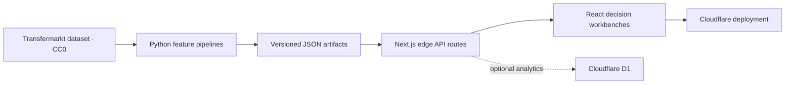

# Touchline Intelligence

[](https://github.com/pharzy1/touchline-intelligence/actions/workflows/ci.yml)


An end-to-end Premier League analytics platform that turns historical football data into three recruiter-facing products: player valuation, similarity scouting, and calibrated match forecasting.

**[Live demo](https://touchlineintelligence.com/)** · [API reference](docs/API.md) · [Architecture](docs/ARCHITECTURE.md) · [Portfolio notes](docs/PORTFOLIO.md)


## Why this project exists

Most portfolio ML projects stop at a notebook. Touchline carries the work through the full product lifecycle: reproducible Python training pipelines, versioned model artifacts, typed edge APIs, an interactive React interface, automated verification, and a live deployment.

### Product surfaces

- **Valuation workbench** estimates a player's market value and uncertainty range from 12 football and profile features.
- **Scouting lab** retrieves same-position alternatives using standardized Euclidean nearest neighbours and explains the strongest shared signals.
- **Transfer builder** composes scouting and valuation into shareable replacement-cost scenarios with multi-player radar comparisons.
- **Licensed media pipeline** caches vetted Commons thumbnails, stores author/licence/source metadata, and falls back safely when identity is uncertain.
- **Match lab** returns calibrated home/draw/away probabilities from sequential Elo and rolling five-match form.
- **Live record** snapshots upcoming predictions before kickoff, grades them after full time, and publishes accuracy and Brier score over time.

## Architecture



The deployed app performs inference from compact, immutable JSON artifacts. It does not scrape websites or retrain models at request time. See [docs/ARCHITECTURE.md](docs/ARCHITECTURE.md) for the data flow and design trade-offs.

## Engineering decisions

Training, calibration, and test data are split **chronologically** for match forecasting so future results cannot leak into earlier predictions. Training emits versioned JSON artifacts with explicit schemas, keeping model training separate from low-latency serving; `pnpm verify:artifacts` rejects malformed or incompatible artifacts before deployment. Edge routes on Cloudflare Workers were chosen over a permanently running server because inference is small, deterministic, and globally cache-adjacent. Every public route uses Zod validation and typed errors, emits structured latency logs, persists anonymous request telemetry to D1 when available, and applies a fail-open per-isolate rate limit. Scheduled fixture syncs persist success/failure telemetry to D1, power a public `/status` freshness dashboard, and retain detailed provider errors only behind a protected diagnostics route. `pnpm check` validates artifacts, creates a production build, and runs the twelve integration tests before CI can deploy.

## Model results

| Capability | Method | Evaluation | Result |
| --- | --- | --- | --- |
| Player valuation | Ridge regression on log market value | Seeded 80/20 holdout, 414 players | R² **0.6135**, MAE **€9.9m** |
| Match forecasting | Regularized multinomial logistic regression + temperature scaling | Chronological season split, 380-match test set | Accuracy **48.16%** |
| Similarity scouting | Same-position standardized nearest neighbours | 414-player index | Explainable top-5 retrieval |

These are transparent baselines, not claims of production-grade sporting certainty. Market values are noisy estimates, and match accuracy should be interpreted alongside calibration metrics in the artifact.

### Numbers versus baselines

| Evaluation | Touchline | Baseline / alternative | Outcome |
| --- | ---: | ---: | --- |
| Valuation holdout R² | **0.6135** | Gradient-boosted trees 0.5500 | Ridge retained for accuracy and explainability |
| Valuation holdout MAE | **€9.91m** | Gradient-boosted trees €10.54m | €0.63m lower error |
| Valuation 5-fold CV | R² **0.400 ± 0.286** | — | Variance reported, not hidden behind one split |
| Match test accuracy | **48.16%** | Always-home 42.63% | +5.53 percentage points |
| Match test accuracy | 48.16% | Elo favourite **49.47%** | Honest result: Elo remains stronger on this test set |

## Stack

- TypeScript, React 19, Next.js 16, Tailwind CSS
- Python, NumPy, scikit-learn, reproducible feature-engineering pipelines
- Cloudflare Workers and optional D1 persistence
- Node test runner and GitHub Actions CI

## Run locally

Requirements: Node.js 22.13+, pnpm 11, and Python 3.11+ only if retraining.

```bash
pnpm install
pnpm dev
```

Open `http://localhost:3000`. The committed model artifacts make local inference work without Python or source data.

### Verify the project

```bash
pnpm check
```

This validates model artifact contracts, creates a production build, and runs the rendered-HTML integration suite. `pnpm test:e2e` adds Playwright coverage for the valuation, scouting, transfer, match, live-performance, and production-status golden paths. GitHub Actions runs both suites on every push and pull request and retains Playwright reports and traces for diagnosis.

### Retrain the models

Place the upstream compressed CSVs in `work/source-data/`, then run:

```bash
python -m venv .venv
source .venv/bin/activate
pip install -r pipeline/requirements.txt
python pipeline/train_model.py
python pipeline/train_match_model.py
```

The pipelines use the CC0-licensed [dcaribou/transfermarkt-datasets](https://github.com/dcaribou/transfermarkt-datasets). Exact methodology and artifact metadata are documented in [data/README.md](data/README.md).

## API

| Endpoint | Purpose |
| --- | --- |
| `GET /api/predict` | Valuation model metadata and metrics |
| `POST /api/predict` | Estimate value from a player profile |
| `GET /api/scouting` | Search players or retrieve comparable profiles |
| `GET /api/matches` | List teams or forecast a fixture |
| `GET /api/stats` | Anonymous API volume and latency aggregates |
| `GET /api/performance` | Immutable pre-match prediction ledger and live grading metrics |

See [docs/API.md](docs/API.md) for parameters, examples, and response shapes.

## Repository map

```text
app/        product UI and edge API routes
data/       versioned inference artifacts
pipeline/   reproducible Python training jobs
scripts/    repository and artifact verification
tests/      rendered-output checks
docs/       architecture, API, and portfolio material
```

## Shipped engineering depth

- Bootstrap uncertainty intervals and per-prediction ridge coefficient contributions
- Ridge versus gradient-boosted tree comparison plus 5-fold cross-validation
- Shareable valuation URLs, explicit match baselines, and D1 request instrumentation
- Six-hour fixture sync, immutable pre-kickoff predictions, post-match grading, and a public accountability curve
- Pipeline-time Wikimedia Commons enrichment with local caching, artifact validation, attribution UI, and position-based fallback avatars
- Zod validation, typed API errors, structured logs, rate limiting, error recovery, and five Playwright E2E flows

## Roadmap

- Season-over-season valuation trends and position-specific valuation models

## License and attribution

Code is available under the [MIT License](LICENSE). The upstream football dataset is separately released under CC0 1.0 by its maintainers. Touchline is an educational portfolio project and not financial, betting, or recruitment advice.
