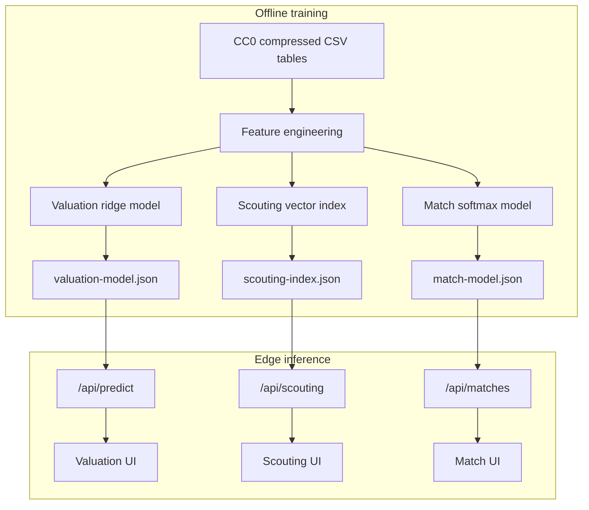

# Architecture

Touchline separates offline model development from online inference. That keeps requests fast, removes Python from the serving path, and makes every prediction traceable to a versioned artifact.

## Training path

`pipeline/train_model.py` joins current Premier League player profiles to latest-season appearances. It engineers availability, production, age, position, and international-experience features. A seeded split trains a ridge regression on `log1p(market_value_eur)`. The same run builds a standardized, same-position scouting index.

`pipeline/train_match_model.py` processes fixtures chronologically. Features only use information available before kickoff: sequential Elo and each team's previous five results. Older seasons train the classifier, the penultimate season selects a calibration temperature, and the latest season remains untouched until final evaluation. This prevents future-match leakage.

## Serving path

Each API route imports an immutable JSON artifact at build time and performs lightweight numerical inference at the edge. Inputs are bounded and validated. Responses include the model version and evaluation metrics so the UI never presents a prediction without context.

Valuation predictions attempt an optional D1 analytics write. Inference still succeeds if the binding is absent or persistence fails, so observability cannot take down the product experience.

## Design decisions

| Decision | Reason | Trade-off |
| --- | --- | --- |
| JSON artifacts | Portable, inspectable, serverless-friendly | Not suitable for very large models |
| Log-target ridge regression | Stable, explainable baseline for skewed values | Misses nonlinear interactions |
| Position-filtered neighbours | Avoids nonsensical cross-position comparisons | Broad position labels lose role nuance |
| Chronological match split | Reflects real deployment and prevents leakage | Fewer recent examples for evaluation |
| Temperature scaling | Improves probability calibration without changing ranking | Uses one season solely for calibration |

## Reliability boundaries

- Training is deterministic where randomness is used (`seed=42`).
- Artifacts carry model version, feature order, source, split, metrics, and timestamp.
- CI validates artifact dimensions and invariants before building the application.
- No runtime scraping or third-party data request is required.
